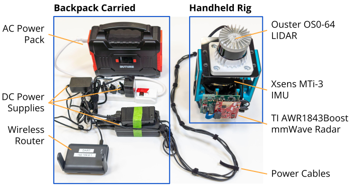

# Rover
Radar chirp data collection platform based on the TI AWR1843/DCA1000EVM.



This repository contains three components, each of which should run on a different machine:
- `lidar`: LIDAR/IMU data collection infrastructure for an Ouster LIDAR + Xsens IMU.
- `radar`: Radar data collection infrastructure for the TI AWR1843Boost + DCA1000EVM.
- `processing`: Radar/LIDAR/IMU data processing to create the final dataset.

## Physical Hardware

- **1 Windows computer** (GUI required) for Radar data collection.
- **1 Ubuntu 20.04 (focal) computer** for Lidar/IMU data collection.
- **[AWR1843Boost Evaluation Board](https://www.ti.com/tool/AWR1843BOOST)**
    - **1 micro USB cable** connecting the AWR1843's USB port to the windows computer.
    - **5v 3A power supply**
    - **NOTE**: sketchy USB cables may cause the radar/capture card to fail to be detected.
- **[DCA1000EVM Capture Card](https://www.ti.com/tool/DCA1000EVM)**
    - Powered via the AWR1843Boost.
    - **1 micro USB cable** connecting the `RADAR_FTDI` port to the windows computer.
- **[Ouster OS0-64 LIDAR](https://ouster.com/products/hardware/os0-lidar-sensor)**
    - **1 Cat5 ethernet cable** connecting the LIDAR interface box to the linux computer.
- **[Xsens MTi-3 AHRS Development Kit](https://shop.movella.com/us/product-lines/sensor-modules/products/mti-3-ahrs-development-kit)**
    - **1 micro USB cable** connecting the IMU's USB port to the linux computer.
- **1 AC Battery Bank** for powering the setup, with an additional power strip if required.

Control System Options:
1. RDP + SSH (Recommended for handheld operation):
    - **1 Windows laptop** for controlling the Windows computer (via Windows RDP).
    - **1 (Wireless) Router** that both computers and the laptop should connect to. Can be replaced with a wired solution if multiple LAN ports are available on each computer (adapters are ok).
    - Make sure to connect both computers to the same network, and assign them known host names (e.g. `dart-lidar` and `dart-radar`).
    - Set static IPs to the radar and lidar computers.
2. Manual Control (Recommended with a cart):
    - **Use a laptop for the Windows and Linux computers**, or connect external displays and keyboards to each.

## Setup

See the [setup guide](docs/setup.md).

## Usage

Note that these steps should be performed simultaneously on the Linux and Windows computer. In particular, `make start` and `python collect.py` should be performed right before the actual data collection step to avoid excess file size.

For a detailed step-by-step breakdown which bypasses any high-level automation for troubleshooting/development, see the [manual data collection instructions](docs/manual.md).

**Linux Computer**, in the `rover/lidar/` directory (collects 3.5GB/minute):

- On reboot (~15 seconds):
    1. Synchronize time with the windows computer: `sudo ntpdate dart-radar.local`
    2. Initialize ROS nodes: `make init`
- On each data collection (~30 seconds):
    1. Plug in the LIDAR. Wait until you can hear/feel the LIDAR reaching a steady state after spinning up.
    2. Start data collection: `OUT=lidar.bag make start` (replace `lidar.bag` with the desired output file name).
    3. Stop data collection: `make stop`.
    4. Unplug the LIDAR.
- Cleanup: `make deinit`

**Windows Computer**, in the `rover/radar` directory (collects 1GB/minute):

- On reboot (~2 minutes):
    1. Power on the Radar, and make sure the `XDS110 Class Application/User UART` COM port matches what you have in `config.json`.
    2. Launch mmWave studio, and wait for all initialization commands to complete: `python init.py`
- On each data collection (~5 seconds):
    1. Run `python collect.py`.
    2. Press `ctrl+C` *once* on `python collect.py` when finished. **Do not close mmWave Studio**, or you will need to restart the whole procedure and reflash the radar and capture card.
- Cleanup: close mmWave studio. The radar can stay powered on.

**Data Processing**, on a separate computer with `cartographer-ros` installed:

- Copy the collected lidar and radar data to a folder; name the lidar data `lidar.bag`, and the radar data `radarpackets.h5`.

- Run cartographer:
    ```sh
    DIR=<dataset_directory> make
    ```
    - Replace `<dataset_directory>` to the folder containing `lidar.bag` and `radarpackets.h5`; all output files are also placed in this folder.
    - When running the makefile, the first step (`roslaunch slam offline_cart_3d.launch ...`) will wait indefinitely after it finishes. This process needs to be manually killed, after which the makefile should resume.
    - Instead of passing `DIR=...`, you can alternatively copy this makefile to the `<dataset_directory>` and simply `make`.

- Run radar processing & dataset packaging:
    ```sh
    python preprocess.py -p <dataset_folder>
    python speed_report.py -p <dataset_folder>
    ```
